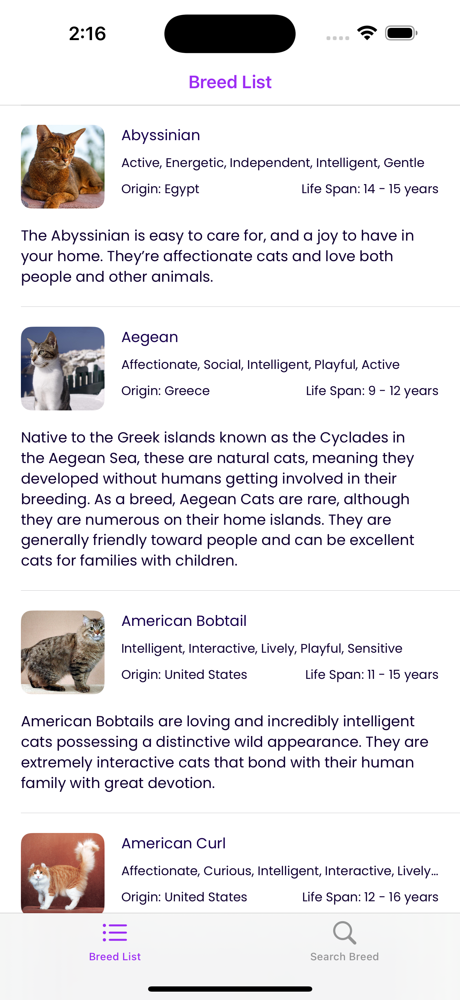
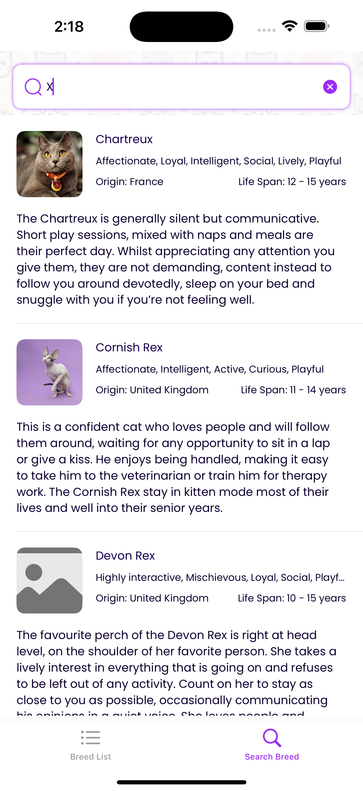
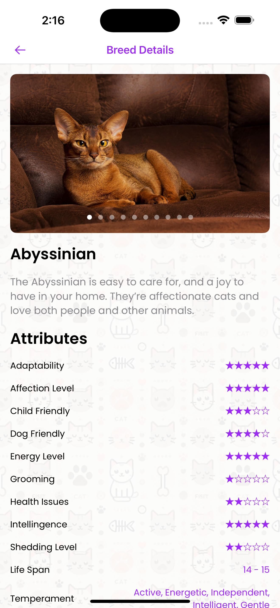
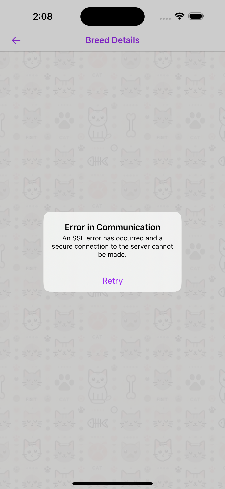

# 🐱 MeowMatch

### **A SwiftUI-based Cat Breed Information App** 🐾


---

## 📌 Overview

**MeowMatch** is an iOS app built using **SwiftUI and MVVM**, allowing users to  
browse cat breeds, view details, and fetch images from an API. The app  
leverages **async/await for concurrency** (without Combine) and a **debounced search**  
for optimized API calls. It also includes a **reusable paging system**.

---

## 🚀 Features

✔️ **Fetch & display cat breed details** (images, attributes, links, descriptions)  
✔️ **MVVM architecture** with `ObservableObject` ViewModel  
✔️ **SwiftUI-based UI** with dynamic lists & custom UI elements  
✔️ **Error handling & retry mechanism**  
✔️ **Network reachability handling**  
✔️ **Cache support**  
✔️ **Debounced search for optimized API requests**  
✔️ **Reusable paging functionality for infinite scrolling**  
✔️ **Async/Await-based API calls (No Combine used)**

---

## 📸 Screenshots

| Home Screen              | Search                       | Details                        | Alert                         |
| ------------------------ | ---------------------------- | ------------------------------ | ----------------------------- |
|  |  |  |  |

---

## 🛠 Tech Stack

- **Swift 5.0+**
- **SwiftUI** - Declarative UI framework
- **Async/Await** - Modern concurrency handling (No Combine)
- **MVVM** - Clean architecture pattern
- **URLSession** - API requests
- **Codable** - JSON Parsing
- **Reusable Paging** - Infinite scrolling support
- **Generic Caching mechanisum** - Generice caching mechanisum with LRU eviction support

---

## 🏗 Architecture

The app follows a **clean MVVM pattern**, separating business logic from UI.

```
MeowMatch/
│
├── App/ # App entry point and environment configuration
│ ├── Environment/ # Handles environment-specific configurations
│ ├── Localization/ # Manages localized strings
│ └── AppEntry.swift # Main app entry point
│
├── Config/ # Configuration files (e.g., API keys, environment)
│
├── Features/ # Feature-specific modules
│ ├── BreadList/ # Manages the list of breeds
│ │ ├── Service/ # API service for fetching breed data
│ │ ├── View/ # SwiftUI views for breed list
│ │ └── ViewModel/ # ViewModels for breed list logic
│ ├── CatDetail/ # Handles cat breed detail feature
│ └── SearchBreeds/ # Handles breed search functionality
│
├── Resources/ # App resources like assets and launch screen
│ ├── Assets.xcassets # Image and color assets
│ ├── Preview Content # Previews for SwiftUI
│ ├── Info.plist # App configuration file
│ └── Launch Screen.storyboard # Launch screen configuration
│
├── Shared/ # Shared components and utilities
├── CacheManager/ # Handles caching logic
├── Components/ # Reusable UI components
├── CoreNetwork/ # Networking layer and API handling
├── Debounce/ # Logic for debouncing API requests
├── EndPoints/ # API endpoints definitions
├── Loader/ # Loading indicators and UI helpers
└── Models/ # Shared data models
```

📌 Key Highlights

```
• App/: Configures the app environment, entry point, and localization.
• Config/: Contains API and environment configuration (e.g., .xcconfig files).
• Features/: Each feature (e.g., BreadList, CatDetail) has its own folder, with a clear separation of Service, View, and ViewModel.
• Resources/: Stores app resources like images, assets, and the launch screen.
• Shared/: Houses reusable components, including network handling, caching, and utility logic.
```

## 📦 Installation Instructions

### 1. Unzip the Project

- Download the zipped file `MeowMatch.zip`.
- Extract the contents to your desired directory.

### 2. Open the Project

- Open **Xcode** (version 13 or later, recommended version 15+).
- Go to **File → Open**.
- Navigate to the extracted folder and open `MeowMatch.xcodeproj`.

### 3. Set Up the API Key

The app uses **The Cat API** to fetch data, and an API key is required:

1. Locate the file `Base.xcconfig` and other xcconfigs to find base url key in the `Config/` folder.
2. Open `Config.xcconfig` and add your API details:
   ```ini
   API_BASE_URL = "api.thecatapi.com"
   API_TOKEN = "YOUR_API_KEY_HERE"
   ```

📌 Closing Message:

```
Dear Reviewer,

Thank you for taking the time to evaluate my submission for Kraken. I have put considerable effort into ensuring the code is clean,  scalable and aligned with best practices. Your feedback and insights are invaluable and I sincerely appreciate the time and effort you dedicate to this review.

Please do not hesitate to provide any suggestions or point out areas for improvement am always eager to learn and grow. I look forward to hearing your thoughts and further refining this project based on your input.

Thank you again for your thoughtful review and support!
```

Contact: +447436597913
email: leo.winc@gmail.com
[LinkedIn](https://www.linkedin.com/in/link2vinsi/?_l=en_US)
